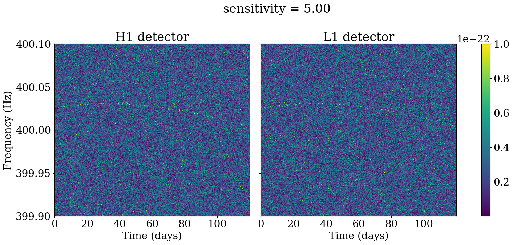
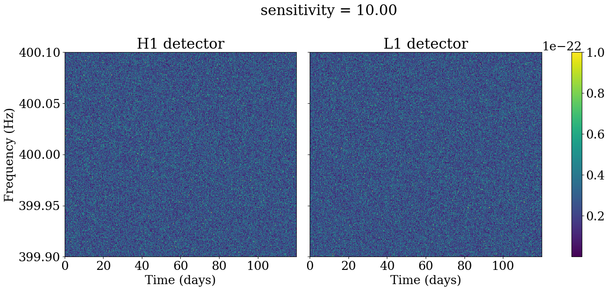

# G2Net: gravitational wave detection

This repository implements deep learning models for long-lasting continuous gravitional waves (CW) detection. 

The data is generated using [PyFstat](https://github.com/PyFstat/PyFstat), which can simulate CW detected by 2 LIGO interferometers, in Hanford (`"H1"`) and Livingston (`"L1"`).

Detecting continuous gravitational wave is a challenging task, since the amplitude of the signal is typically orders of magnitude lower than the amplitude of the detector noise.

Below are some examples of CW noisy signals with varying sensitivity depths, where sensitivity depth is defined as the ratio between the noise and signal amplitudes. The CW signal is visible for a sensitivity of 5, but visual features tend to disappear for a sensitivity of 20 or below. 






---

# Requirements

Apart from standard libraries (numpy, matplotlib etc), the following are required:

- `PyFstat` (version 1.19.0), for data generation
- `Pytorch` for model training
- `timm` for pretrained models

# Data generation

To generate a dataset with a specific sensitivity and number of files, run:

```
python generate_data.py --sensitivity 10.0 --num_signals 1000
```

This will generate a dataset containing both noise-only and noisy CW signals with randomized parameters. The labels (`1` if the data contains a CW, otherwise `0`) are also stored as csv file.

See PyFstat's [tutorial notebook](https://github.com/PyFstat/PyFstat/blob/master/examples/tutorials/0_generating_noise.ipynb) for more details on data generation and signal parameters.   

Or you can simply run:

```
./generate_all_data.sh
```
to generate 4 datasets with sensitivity 5.0, 10.0, 15.0 and 20.0, with 1000 samples each.

# Model training & evaluation

We provide 3 CNN-based models (in `utils.models`). A simple custom CNN with 3 convolutional layers and 2 fully-connected (FC) layers for the classifier, a deeper CNN with 4 conv layers and 3 FC layers, and an even deeper CNN using EfficientNet_b0 as a backbone.

#### Data preprocessing/augmentation

The data coming from both sensors is first cropped and concatenated to be of shape 2x360x4272. For each sample we compute the power of the complex spectrogram, and normalize it to be of zero-mean unit-variance. For computational efficiency, we compute the average over 48 consecutive time frames, such that the input image to each model is of size 2x360x89. Since each time frame corresponds to a 30 minutes of acquisition, averaging over 48 frames corresponds to averaging over a 24h day, which should also attenuate short-scale amplitude modulations due to the rotation of the Earth. Note that this averaging is implemented as a convolutional layer (with frozen weights) in order to make use of the GPU. 

As optional data augmentation, we also randomly translate the signal along frequencies, and randomly set time frames to zero to simulates times were one detector was off. 

To train a model on the generated data, run:

```
python train_model.py --model_name CNN --data_folder data/ --device mps --num_epochs 15
``` 
The best model (in terms of Area Under the Curve on the validation set) is saved to `saved_models/`.